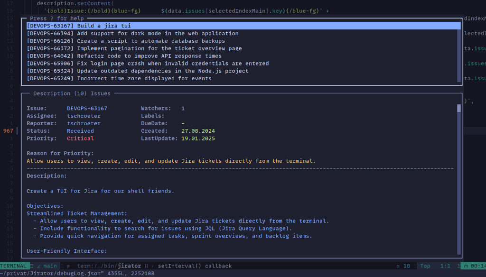

# Jirator

Jira TUI application, will maybe not work with Jira Cloud.



## Feature

- Basic vim motions
- Fuzzy Search and error correction (Levenshtein Distance)
- Assign issues to your account
- Transission Jira status like Start Progress, Close, Resolve...
- Open and write comments
- Show watchers and watch issues
- Open your own list of JQL searches
- Open the current issue in the browser

## installation

### Get Access Token

Go to your profile <https://jira.example.com/secure/ViewProfile.jspa> and generate a Personal Access Tokens.

### ENV

```bash
export JIRA_HOST="jira.example.com"
export JIRA_API_TOKEN="123"
```

### config

```json
[
  [
    "Issues CurrentUser",
    "assignee = currentUser() AND resolution = Unresolved ORDER BY updated DESC"
  ]
]
```

```bash
git clone git@github.com:tinoschroeter/Jirator.git
cd Jirator

npm install
npm install -g .

jirator
```

## Update

```bash
cd Jirator
git pull
```

## JQL filter

```js
[
  [
    "Issues CurrentUser",
    "assignee = currentUser() AND resolution = Unresolved ORDER BY updated DESC",
  ],
  [
    "Filter Quckwin List",
    "project = <PROJECT> AND assignee = <ASSIGNEE> AND status != Closed AND labels = quickwin",
  ],
  [
    "Watched Issues",
    "watcher = currentUser() AND resolution = Unresolved ORDER BY updated DESC",
  ],
  [
    "Backlog List",
    "project = <PROJECT> AND assignee = <ASSIGNEE> AND status != Closed ORDER BY priority",
  ],
];
```

## Vim

```bash
vim.keymap.set("n", "<leader>j", function()
  Snacks.terminal.open({ "jirator", vim.api.nvim_buf_get_name(0) })
end, { desc = "Jira" })
```

## Links

- [Jira REST API v2](https://developer.atlassian.com/cloud/jira/platform/rest/v2/intro/#about)
